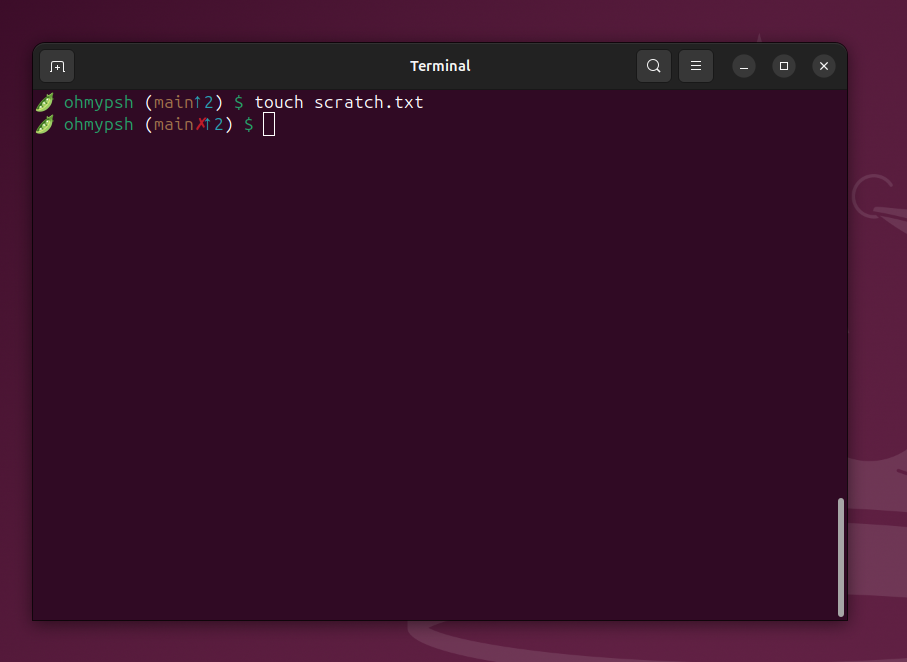
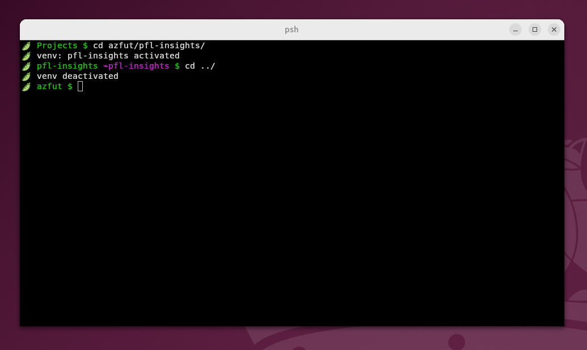
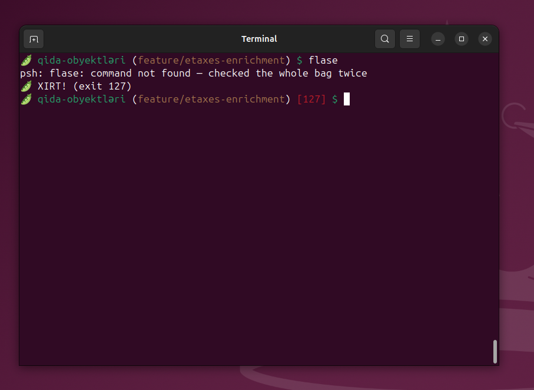

# 🫛 psh — the pistachio shell

[](https://github.com/marmeladze/ohmypsh/actions/workflows/ci.yml)

> The pistachio has one of the hardest shells in the world. It deserved
> a place in the hall of fame next to bash, fish, and zsh. So here it is.

`psh` is a Unix shell written from scratch in C — a real one, with
`fork()` and `exec()` and everything. It follows the **familiar core**
philosophy: your fingers already know it (`ls | grep foo`, `$HOME`,
`&&`), but the classic sh traps are fixed — most importantly, variables
will never word-split, so `rm $file` deletes exactly one file, always.

## Status

**v0.13.0 — the cage and the oracle.** Every numbered horizon of
[the roadmap](docs/ROADMAP.md) closed: `cage` runs untrusted
commands against a kernel-enforced read-only world, and the
**agent** plugin's `??` asks an AI in plain words and stages the
answer in your prompt — editable, never auto-run. The cockpit: a hand-rolled
raw-mode line editor with **fish-style autosuggestions** (your
history, grey, one → away), **syntax highlighting straight from
the shell's real lexer** (valid commands green, typos red before
you press Enter), incremental Ctrl-R search, tab completion,
bracketed paste, multi-line editing, Ctrl-X Ctrl-E. Zero
dependencies — readline sailed home in v0.11.0.

New in v0.12.0: **the H7 wire** — numbered-fd redirections
(`2>&1`, `3<>`, dup/close), the `exec` and `read` builtins, and
`/dev/tcp/HOST/PORT` sockets, proven against a live redis with a
pure-psh client plugin; **the armory** — `salt` and `roast` (see
below); and the **Google-audit hardening**: `${var#pat}`-family
parameter operators, heredocs, `set -u`/`-o pipefail`,
`$PIPESTATUS`, `readonly`, and `\`-newline continuation.

Underneath: a complete language (`if`/`elif`/`else`, `while`, `for`,
`case`, functions with `$1`..`$9` and a true `$@` splat,
`local`/`export`/`unset` on a real three-tier variable table,
`$((...))` arithmetic, `$(...)` command substitution), hardened for
scripts (`test`/`[` as fork-free builtins, `type`, `command -v`,
`set -e`, `trap ... EXIT`, parse errors with line numbers), on top
of full job control (`&`, Ctrl-Z, `jobs`/`fg`/`bg`/`wait`),
pipelines, redirects, `&&`/`||`, globbing, `~/.pshrc`, scripts with
shebangs, `psh -c`, `source`, and `#` comments.

Two founding rules, both real: a `$VAR` NEVER word-splits
(`F="two words"; rm $F` deletes exactly one file), and `$(...)`
splits on newlines only (`for f in $(ls)` iterates lines, spaces in
filenames survive).

Prefer watching to reading? The
[**psh Flow Theater**](https://claude.ai/code/artifact/abbdfe69-bbd9-4b4f-bb12-4f4770f01f40)
plays the shell's internals as six animated scenes — a keystroke
becoming a fork, three pipeline children running at once, the fd
park-and-unwind, a PING traveling down `/dev/tcp` to redis and
back, Ctrl-Z's journey, and the `*incomplete` flag turning an
unfinished `if` into a `  > ` prompt.

## 🫛 oh-my-psh

The framework this project was named for — written in psh, running
on psh. Themes are prompt templates re-expanded on every prompt;
plugins are sourced files of functions; `omp_precmd` runs before
each prompt. Install it into your `~/.pshrc`:

```sh
./psh omp/install.psh
```

Ships with the **antep** theme (maximum green: directory, ⌁venv,
git branch with ✗ dirty marker and ↑↓ arrows, red failure status)
and a fleet of plugins: **python** (venvs auto-activate when you cd
into a project — never type `source .venv/bin/activate` again),
**git**, **django**, **flask**, **rails**, **docker**, **npm**,
**basics** (`ll`, `la`, `mkcd`), **redis** (`rget`/`rset`/`rmon`, a
real client over `exec 9<>/dev/tcp` — pure psh, no redis-cli),
**agent** (`?? find big logs from last week` asks an AI CLI and
stages the answer in your prompt — editable, highlighted, run only
by your Enter; `oops` explains the last failure), and
**shell-shock**, which — as the
founding documents foretold — goes *XIRT!* when a command fails.
Drive it with `omp list`, `omp enable <plugin>`, `omp theme <t>`.
Plugins register on precmd/chpwd hooks; writing your own is ~20
lines of psh.

Antep Mode in the wild — the git segment catching a tree going
dirty:



a venv activating itself on `cd` in (and deactivating on `cd` out):



and shell-shock keeping morale up after a typo:



## 🧂 salt

The armory's cat. Prints files like cat, colors them like bat, under
one rule: **the bytes are never changed, only colored.** Copying
salted output yields exact source (no gutters, no frames); piped
output is byte-identical to the input; `tail -f log | salt -l yaml`
highlights live, line by line. Markdown renders headers, emphasis
and links, and fenced code blocks are highlighted in their own
language — while staying valid Markdown on the clipboard.

```sh
salt file.c              # colors, and only colors
salt README.md           # markdown worth reading
tail -f app.log | salt -l yaml    # streams
salt -c big.py | less -R          # pages
```

Languages: C, sh/psh, Python, Markdown, JSON, diff, YAML, TOML,
JS/TS, Go, Rust, Ruby, Elixir. `-n` for line numbers (opt-in — they
do land in copies), `-L` lists the arsenal.

## 🔥 roast

The armory's Markdown renderer — salt's opposite number. You salt a
pistachio to keep it what it is; you roast it to turn it into
something better. Headings lose their `#`s and gain underlines,
`- [ ]`/`- [x]` become ☐/☑, bullets become • ◦ ▪, emphasis markers
vanish into real bold and italics, quotes grow a ┃ bar, tables
align into ruled columns, links become clickable OSC 8 hyperlinks,
and fenced code keeps salt's highlighting while the fences
themselves disappear. Still line-streamed (only tables buffer), so
`tail -f NOTES.md | roast` stays live.

```sh
roast README.md          # this file, as a document
roast docs/ROADMAP.md    # checkboxes look like checkboxes
```

Reading is roast's job; copying source is salt's.

## 🔒 cage

The armory's sandbox. `cage ./sketchy-install.psh` runs anything
against a **read-only filesystem** — kernel-enforced via Landlock,
unprivileged, zero dependencies — with writes allowed only in a
fresh scratch dir (`$CAGE_DIR`, kept afterwards so you can inspect
what it tried to build), any `-w DIR` you grant, and `/dev/null` +
`/dev/tty`. Denied writes hit the script as plain `EACCES`, so its
own error messages name every blocked path. Run the sketchy thing
first, read the damage report, then let it loose. On kernels
without Landlock, cage **refuses** rather than silently running
uncaged.

```sh
cage ./curl-piped-installer.sh     # what does it REALLY touch?
cage -w build make                 # build allowed, nothing else
```

## Build & run

```sh
make        # builds ./psh and ./salt
make test   # runs the smoke tests
./psh       # step into the bag
```

Requires a C compiler and a POSIX system. That's the whole list —
no libraries, no packages, no `-dev` anything.

## Layout

```
src/main.c       the REPL, scripts, -c, ~/.pshrc, multi-line input
src/lexer.c      input → tokens (words raw; quotes and $() intact)
src/parser.c     recursive descent: if/while/for/functions/lists
src/expand.c     $VAR, $1..$9, $@, $(...), $((...)), ~, quotes, glob
src/vars.c       locals → shell vars → environ; export / local / unset
src/arith.c      the $(( ... )) evaluator
src/testcmd.c    the test / [ builtin (fork-free conditions)
src/exec.c       tree walker: pipelines, control flow, functions
src/jobs.c       job control: process groups, tcsetpgrp, Ctrl-Z
src/editor.c     the cockpit: autosuggestions, syntax highlighting,
                 ^R search, tab completion, ^X^E, bracketed paste
src/complete.c   completion candidates (commands + files)
src/builtins.c   cd, exit, pwd, help, …
src/pistachio.c  🫛 easter pistachios live here, and only here
tools/salt.c     🧂 salt: cat with colors, faithful to the bytes
tools/roast.c    🔥 roast: Markdown rendered for reading
tools/cage.c     🔒 cage: run a command against a read-only world
tools/hl.h       the shared highlight engine salt and roast use
omp/             oh-my-psh: themes/, plugins/, install.psh — in psh
docs/ROADMAP.md  where this is going
extras/lore/     the sacred founding documents (oh-my-pistachio era)
```

## Salt levels

Some behavior in this shell is nutritionally unnecessary. It is all
contained in `src/pistachio.c` and guaranteed never to affect
correctness. Try `help` and read closely.

## Quality

`make test` (116 smoke tests), `make test-asan` (the same suite under
AddressSanitizer + LeakSanitizer — zero errors, zero leaks), and
`bash tests/fuzz.sh` (2000 hostile inputs, zero crashes: the shell
would not crack). CI runs all three on every push. `man docs/psh.1`
for the manual.

## License

MIT (see LICENSE) — source and binaries alike, now that the last
GPL-licensed link went overboard.

---

*NTT layihəsidir. Sistem indi duzludur.* 🫛
